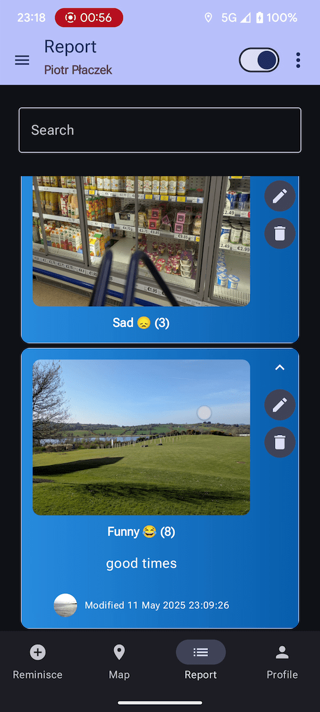

<!-- markdownlint-configure-file {
  "MD033": false,
  "MD041": false
} -->

# Remnant

App for sharing *remnants* (pictures and memories).

Made for CA2 of the SETU Mobile App Development 2 module.

## Features

- [x] Remnant CRUD (using Firebase Firestore)
  - [x] Create
  - [x] Read
  - [x] Update
  - [x] Delete
  - [x] Search
- [x] Accounts (using Firebase Auth)
  - [x] Google Sign-in
  - [x] Basic Email + Password Auth
- [x] Storage (using Firebase Storage)
  - [x] User Avatars
  - [x] Remnant Images
- [x] Remnant Map (using Google Maps API)
  - [x] Markers with Remnant Info
- [x] Dark Mode (using Material 3 Theme)
- [x] Image fetching using Coil
- [x] MVVM Design Pattern

## Screenshots

|   |   |
|:-:|:-:|
|  |  |
|  |  |

## Diagrams

## Git approach

Used [Conventional Commits](https://www.conventionalcommits.org/en/v1.0.0/).

## References

Made using the following resources:

- SETU MAD2 Labs
- <https://stackoverflow.com/questions/78058099/mutating-variables-in-child-component-and-accessing-state-in-parent-component-ko>
- <https://stackoverflow.com/questions/77299419/how-to-use-context-in-viewmodel-with-hilt-on-android>
- <https://stackoverflow.com/questions/68371219/this-field-leaks-a-context-object-warning-hilt-injection/68372244#68372244>
- <https://stackoverflow.com/questions/68164883/how-do-i-create-a-jetpack-compose-column-where-a-middle-child-is-scrollable-but>
- <https://stackoverflow.com/questions/66084889/how-to-convert-imagevector-to-imagepainter-in-jetpackcompose>
- <https://stackoverflow.com/questions/42205767/context-getpackagename-vs-buildconfig-application-id>
- <https://stackoverflow.com/questions/76907718/compose-take-photo-with-camera-and-display-result-not-working>
- <https://stackoverflow.com/questions/11411395/how-to-get-current-foreground-activity-context-in-android>
- <https://stackoverflow.com/questions/73472851/set-modifier-height-width-to-coil-image-or-asyncimage-and-scal-the-image-loaded>
- <https://developer.android.com/develop/ui/compose/quick-guides/collections/display-images>
- <https://developer.android.com/develop/ui/compose/quick-guides/content/load-images>
- <https://developer.android.com/develop/ui/compose/components/menu>
- <https://cs.android.com/androidx/platform/frameworks/support/+/androidx-main:compose/material3/material3/samples/src/main/java/androidx/compose/material3/samples/ExposedDropdownMenuSamples.kt>
- <https://developer.android.com/reference/kotlin/androidx/compose/material/package-summary#ExposedDropdownMenuBox(kotlin.Boolean,kotlin.Function1,androidx.compose.ui.Modifier,kotlin.Function1)>
- <https://developer.android.com/develop/ui/compose/components/slider#advanced-implementation>
- <https://medium.com/@dheerubhadoria/capturing-images-from-camera-in-android-with-jetpack-compose-a-step-by-step-guide-64cd7f52e5de>
